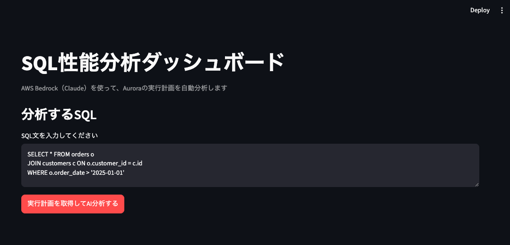
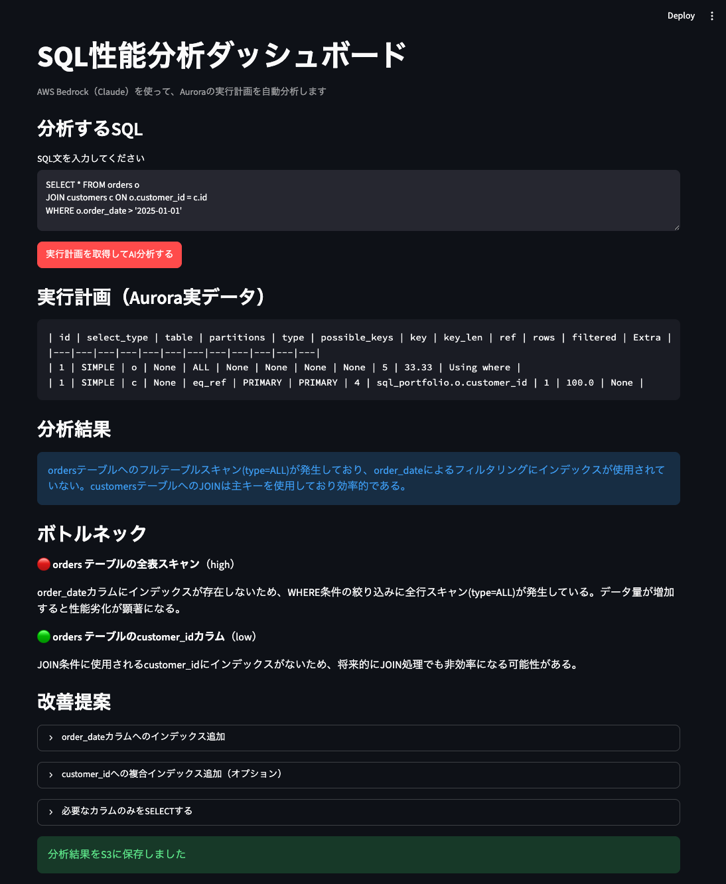

# SQL性能分析ポートフォリオ

オンプレミスのOracle環境における性能テスト業務の知見を活かし、
AWS BedrockのAIを使ってSQL実行計画を自動分析するツールです。

## 概要
SQL文と実行計画を入力すると、Claude（AWS Bedrock）がボトルネックを分析し、
具体的な改善案（インデックス作成、統計情報更新など）をJSON形式で提案します。
分析結果はS3に自動保存されます。

## 使用技術
- Python 3.13
- AWS Bedrock（Claude Sonnet 5）
- boto3
- Amazon S3

## 現在の実装状況
- [x] Bedrockを使ったSQL実行計画のJSON構造化分析
- [x] 複数SQLパターンでの動作確認
- [x] 分析結果のS3自動保存
- [x] Auroraを使った実データでの性能比較
- [x] 分析結果の可視化ダッシュボード

## エラーハンドリング

- DB接続失敗（Auroraの一時停止・タイムアウトなど）
- 不正なSQL文（構文エラー、存在しないテーブル・カラム）
- Bedrock呼び出し失敗、および分析結果のJSON解析失敗
- S3への保存失敗

上記のケースを個別に検知し、原因が分かるメッセージをダッシュボード上に表示するようにしています。

## テスト

DB接続やBedrock API呼び出しを必要としないロジック部分について、単体テストを用意しています。

​```bash
pytest -v
​```

- `test_format_markdown.py`：実行計画のMarkdown変換ロジック（空データ、None値混入などのエッジケースを含む）
- `test_bedrock_logic.py`：Bedrockレスポンスの解析ロジック（テキスト抽出、コードブロック除去、JSON解析）

実際にテスト駆動で末尾の改行が残るバグを発見・修正した実績もあります。


## 実行方法

### 1. 環境構築
```bash
python -m venv venv
source venv/bin/activate
pip install -r requirements.txt
```

### 2. 環境変数の設定
`.env`ファイルを作成し、Aurora接続情報とAWS認証情報を設定してください。

### 3. ダッシュボードの起動
```bash
streamlit run dashboard.py
```

ブラウザで `http://localhost:8501` にアクセスし、SQL文を入力すると、実行計画の取得からBedrockによる分析・S3保存までを一気通貫で確認できます。

## スクリーンショット
### SQL入力画面


### 分析結果画面

